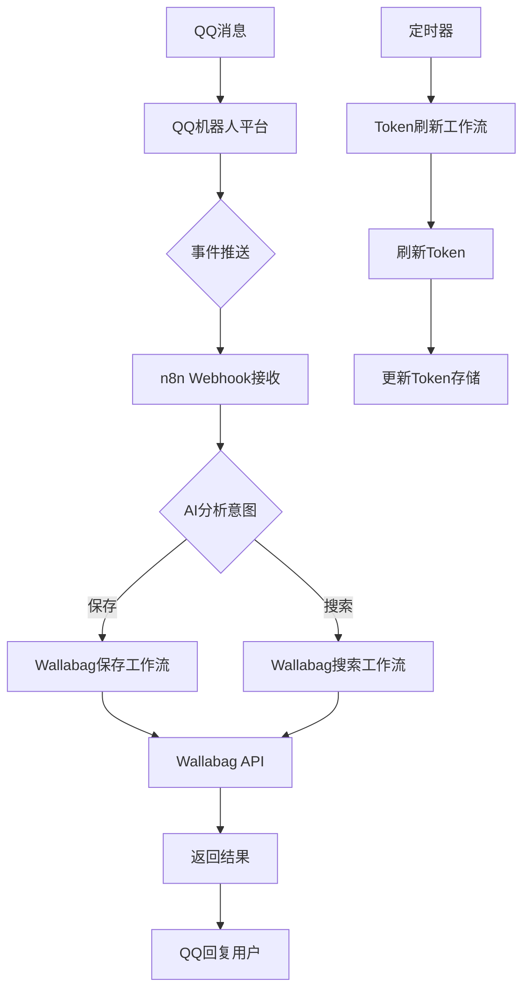

# QQ 机器人 + Wallabag + n8n 完整配置指南

## ✅ 已创建的工作流

### 1. Wallabag 保存文章
- **Webhook URL**: `https://n8n.meowlove.cn/webhook/wallabag-save`
- **功能**: 接收 URL 并保存到 Wallabag
- **状态**: ✅ 已激活

### 2. Wallabag 搜索文章
- **Webhook URL**: `https://n8n.meowlove.cn/webhook/wallabag-search`
- **功能**: 支持按标签、关键词、时间范围搜索
- **状态**: ✅ 已激活

### 3. Wallabag Token 自动刷新
- **功能**: 每 50 分钟检查 Token，自动刷新
- **状态**: ✅ 已激活

---

## 🔧 需要在 n8n 中完成的配置

### 步骤 1：创建 Wallabag 凭证

1. 登录 n8n：https://n8n.meowlove.cn
2. 进入 **Credentials** 页面
3. 点击 **New Credential**
4. 选择 **Header Auth** 类型
5. 配置：
   - **Credential Name**: `Wallabag Token`
   - **Header Name**: `Authorization`
   - **Header Value**: `Bearer YmNlMWZjZjAxNzE0ZTU5YWQzOTBhMzY0ODNkN2Y1YjQyYjUyNzZiMDA2YjJiMmZhODA1NjI0ZjUxMTFjNzY5OA`
6. 保存

### 步骤 2：在 QQ 机器人开放平台配置

1. 登录 QQ 机器人开放平台：https://bot.q.qq.com
2. 进入您的机器人管理页面
3. 配置回调地址/事件推送

---

## 📱 QQ 机器人 API 配置

### 您的 QQ 机器人信息
- **AppID**: `102838256`
- **AppSecret**: `SYfmu2AJScmx8KWjw9Nbq5Lbs9Rj1Kdx`

### 事件推送配置（回调地址）

将以下地址配置到 QQ 机器人的不同场景：

| 场景 | 回调地址 |
|------|----------|
| **群聊** | `https://n8n.meowlove.cn/webhook/wallabag-save` (保存) |
| **群聊** | `https://n8n.meowlove.cn/webhook/wallabag-search` (搜索) |
| **单聊** | 同上 |

---

## 💬 QQ 交互方式

### 保存文章
```
保存 https://example.com/article
```

### 搜索文章
```json
{
  "keyword": "关键词"
}
```

### 按标签搜索
```json
{
  "tag": "#技术"
}
```

### 按时间搜索（最近N天）
```json
{
  "days": "7"
}
```

---

## 🔄 自动刷新 Token

Token 刷新工作流已配置，每 50 分钟自动检查并刷新 Token，无需手动干预！

**当前 Token**: `YmNlMWZjZjAxNzE0ZTU5YWQzOTBhMzY0ODNkN2Y1YjQyYjUyNzZiMDA2YjJiMmZhODA1NjI0ZjUxMTFjNzY5OA`
**刷新 Token**: `YzA2YzhmODU5ZTBjMTQ3YmNmYmVhNDZiNDM0NThhZjFiMzFjMzUyNjM1MjUwZDcxMzA1NGMyZWRhM2IwYjNiZQ`

---

## 📊 系统架构



---

## 🎯 下一步

1. **在 n8n 中创建 Header Auth 凭证**（上面步骤1）
2. **在 QQ 机器人平台配置回调地址**
3. **测试发送消息**

完成这些后，您的 QQ 机器人就可以管理 Wallabag 文章了！

需要我帮您创建其他功能吗？比如：
- 阅读统计/趋势分析
- 导出到 Obsidian
- AI 自动标签分类
